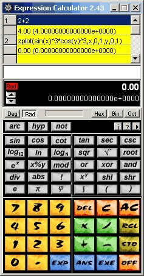
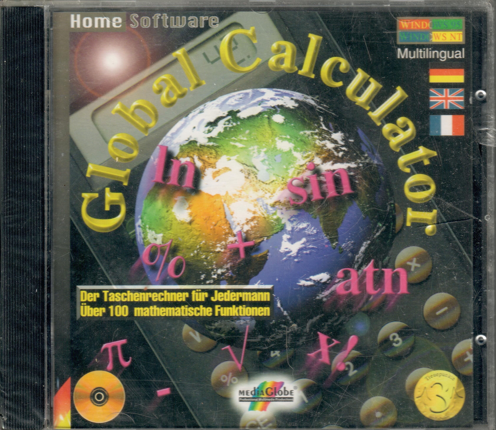
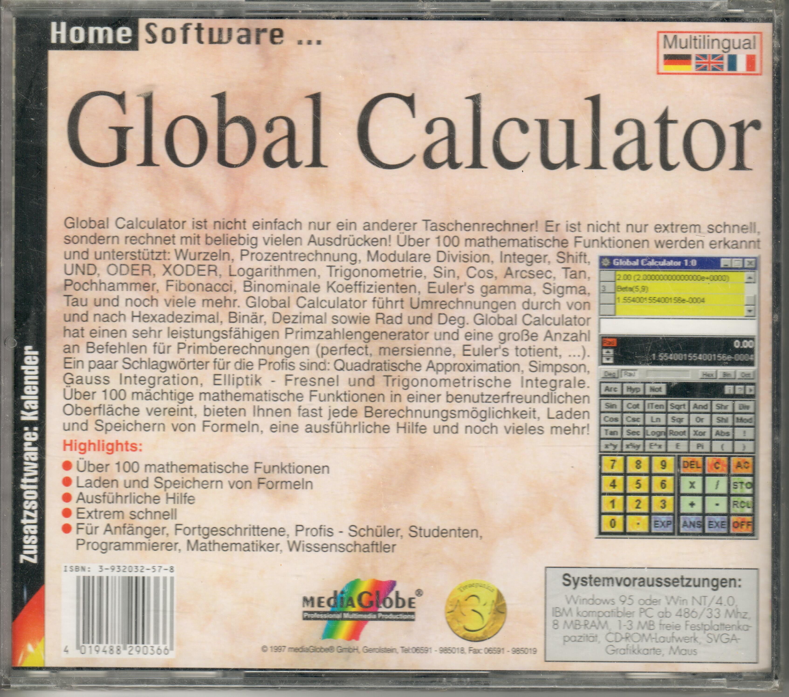

# History

`excalc-rs` is a Rust "spirit port" of the Vestris Inc. Expression Calculator, a shareware Windows application from the mid-90s written in Delphi/Pascal. These links document where it came from.

- [excalc.vestris.com, archived Dec 2003](https://web.archive.org/web/20031213112526/http://excalc.vestris.com/) — the original product site on the Wayback Machine, a nice snapshot of the era: shareware/registered downloads, a full PDF user's guide, and the pitch ("over 100 mathematical expressions, its multithread capabilities and its complete documentation with historical references, algorithms and more").
- [Introducing the Expression Calculator, archived Dec 2003](https://web.archive.org/web/20031205012121/http://excalc.vestris.com/docs/concepts.html) — the original "concepts" page:

  > The Expression Calculator is a powerful mathematical expressions evaluator, suitable for a very broad variety of applications. It is perfect for kids learning basics of algebra of additions, divisions and multiplications. It is excellent for students starting to discover modern mathematics of integrals, series and functions with multiple variables. It's convenient to sum up your monthly bills or to do your taxes. It can even do your loan calculations and even better, you can define the functions you want.
  >
  > The Expression Calculator engine is capable of executing tasks in a parallel, multithreaded manner. This allows you to launch a time-consuming three-dimensional plot operation, and execute a second task without waiting for the first one to complete. This software is fully 32-bit object oriented and is designed for Windows 2000, NT and Windows 95/98. Expression Calculator has been developed using © Borland Delphi.

- **Dedication**: Expression Calculator is dedicated to the genius of Swiss mathematician Leonhard Euler (Basel, 1707 - St-Petersburg, 1783). See [The MacTutor History of Mathematics Archive's biography of Euler](http://www-groups.dcs.st-andrews.ac.uk/~history/Mathematicians/Euler.html) for more.

- [History of the Expression Calculator, archived Dec 2003](https://web.archive.org/web/20031207010839/http://excalc.vestris.com/docs/concepts-history.html) — how it started, and who wrote it:

  > Daniel Doubrovkine (aka dB.) (http://www.dblock.org) is the developer of the Expression Calculator core code. He founded Stolen Technologies Inc. in 1994, which became Vestris Inc. later in 1997. He owns a B.Sc. from the University of Geneva. Original co-founder of Xo3 S.A., he quit the group and left for Redmond, Washington in the United States where he currently works for Microsoft Corporation in the Next Generation Windows Services group.
  >
  > Expression Calculator started as a simple expression evaluator, a university lab task. It is also known as the Global Calculator, distributed on a CD-ROM in Germany in three languages, English, German and French by MediaGlobe Gmbh.

- **Global Calculator, MediaGlobe GmbH, 1997**: the commercial German CD-ROM release, front and back cover:

   

- [Bibliography, archived Oct 2003](https://web.archive.org/web/20031002182157/http://excalc.vestris.com/docs/concepts-books.html) — the references cited by the original documentation for the algorithms behind the calculator:

  - N. Wirth (Eidgenossische Technische Hochschule, Zürich, Switzerland) - _Algorithms + Data Structures = Programs_, Izdatel'stvo Mir, Moscow, 1985
  - R. Sedgewick (University of Princeton) - _Algorithms in C language_, InterEditions, Paris, 1991
  - B. Stroustrup (AT&T Bell Laboratories) - _The C++ Programming Language_ (second edition), AT&T Bell Telephone Labs Inc., 1993
  - E. Hairer - G. Wanner (University of Geneva) - _Analysis by it's History_, Springer-Verlag, 1995
  - G. Haussmann (University of Geneva) - _Algebra I + II_, 1995-96
  - E. Hairer (University of Geneva) - _Analyse Numérique_ (second edition), University of Geneva, 1993
  - M. Abramowitz, I. Stegun - _Handbook of Mathematical Functions_, Dover Publications Inc., New York, 1965
  - A. Erdelyi - _Higher Transcendental Functions_, McGraw-Hill, 1953
  - C. Berezinsky - _Accélération de la Convergence en Analyse Numérique_, Lecture Notes in Mathematics, Nr. 584, Springer-Verlag, 1977

- [Documentation toolchain, archived Dec 2003](https://web.archive.org/web/20031207010712/http://excalc.vestris.com/docs/concepts-copyright.html) — the original user's guide was written in XEmacs using SGML (DocBook DTD), then converted to HTML and PDF with SgmlTools 2.0.2 (Jade, TeX, and Awk scripts) — a reminder of just how much has changed in doc tooling since.

- [Expression Calculator 2.43 Users Guide (PDF), archived Jan 2004](https://web.archive.org/web/20040129021441/http://excalc.vestris.com/docs/pdf/excalc.pdf) — the full 189-page manual, published March 2001: concepts, the Windows UI, constants, operators, ~100 general/trigonometric/special/number-theory functions with formulas and examples, integrals, plots, and financial functions. This is the primary source being ported into [docs/](docs/README.md).
- [Documentation HTML tree, archived Dec 2003](https://web.archive.org/web/20031205014552/http://excalc.vestris.com/docs/index.html) — the same manual, browsable page by page as HTML instead of one PDF.

- [dblock/excalc](https://github.com/dblock/excalc) — the original Pascal/Delphi source, open-sourced by its author (this project's maintainer) years after Vestris Inc. wound down; `common/MCalc.pas` is the calculator engine this project ports.

## User comments

From the [guestbook](https://web.archive.org/web/20010422210554/http://agnes.vestris.com/db-cgi/intensive/guest?ExcalcGuest+ExcalcGuestHTML), archived Apr 2001 (oldest first):

- **Sean Lacey, Sat Mar 20 05:18:00 1999**: "I just want to say thank you for your product. Last night I was doing my math homework and all of a sudden my calculator went on the fritz. So immediatly I got online and, going to download.com, came across Expression calculater(Not enough space to type!)"
- **Dr. Apu Sivadas, Wed May 19 04:10:20 1999**: "exceptionally well designed program which makes computation a delight. It makes me remind of all the good things from Unix and Matlab. The people behind them are indeed good programmers plus good mathematicians."
- **Christian Rose, Wed Oct 6 12:28:00 1999**: "I've never used any better calculator software. But as I'm now moving to Linux, I wonder if the Expression Calculator will ever be ported to Linux?"

See [DESIGN.md](DESIGN.md) for how the engine was reimplemented in Rust "in spirit" rather than line-by-line, and what's ported vs. deferred vs. skipped.
