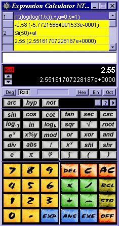

Expression Calculator (Rust)
=============================



[](https://github.com/dblock/excalc-rs/actions/workflows/ci.yml)
[](https://coveralls.io/github/dblock/excalc-rs?branch=master)

A portable expression calculator, built as a CLI tool and an MCP server so AI coding agents like Claude and GitHub Copilot can outsource arithmetic instead of computing it themselves — saving tokens and avoiding LLM math mistakes.

Spiritual successor to the Vestris Inc. shareware Expression Calculator that I wrote in 1996 in Pascal. It was also pressed on a CD-ROM, translated, and sold in Germany under the name Global Calculator in 1997. See [HISTORY.md](HISTORY.md).

## Install

```bash
cargo install excalc
```

This installs the `excalc`, `calc` (a shorter alias for `excalc`), and `excalc-mcp` (see [MCP Server](#mcp-server)) binaries to `~/.cargo/bin` (make sure it's on your `PATH`). Requires a [Rust toolchain](https://rustup.rs/).

If you already have another `calc` on your `PATH`, check `which calc` after installing — `cargo install` won't warn you if it shadows an existing command.

If you only want the CLI and not the MCP server (skipping the `rmcp`/`tokio` dependencies it pulls in):

```bash
cargo install excalc --no-default-features
```

`excalc-mcp` exposes the evaluator as an `evaluate` tool over stdio via [MCP](https://modelcontextprotocol.io/), for AI agents that support it instead of shelling out to the CLI:

```bash
copilot mcp add excalc -- excalc-mcp   # GitHub Copilot CLI
claude mcp add excalc -- excalc-mcp    # Claude Code
```

## Usage

```
calc "2 + 2 * 3"
# 8

calc "sqrt(16) + sin(pi/2)"
# 5

calc "1/0"
# error, exit code 1
```

Run `calc --help` (or `excalc --help`) for full usage.

Without installing, you can also run it straight from a checkout of this repo:

```
cargo run -- "2 + 2 * 3"
# 8
```

### Examples

Everything below works today (v1). See [docs/](docs/README.md) for full reference documentation, including domains and error conditions for each function, and what's planned but not yet implemented.

**Arithmetic operators** ([details](docs/functions/operators.md)):

```
calc "2 + 2 * 3"          # 8
calc "10 - 4 / 2"         # 8
calc "7 mod 3"            # 1
calc "2 ^ 10"             # 1024      (power)
calc "2 \ 9"              # 3         (n-th root: the 2nd root of 9)
calc "5!"                 # 120       (factorial)
calc "50%"                # 0.5       (percent)
calc "(2 + 3) * 4"        # 20        (grouping)
calc -- "-5 + 3"          # -2        (unary minus needs -- so clap doesn't treat it as a flag)
```

**Standard math** ([details](docs/functions/standard-math.md)), all angles in radians:

```
calc "sqrt(16)"           # 4
calc "ln(e)"              # 1         (natural log)
calc "log(100)"           # 2         (base 10)
calc "logn(8, 2)"         # 3         (log base 2 of 8)
calc "sin(pi/2)"          # 1
calc "cos(0)"             # 1
calc "tan(pi/4)"          # ~1
calc "asin(1)"            # ~1.5708   (pi/2)
calc "acos(0)"            # ~1.5708   (pi/2)
calc "atan(1)"            # ~0.7854   (pi/4)
calc "sinh(1)"            # ~1.1752
calc "cosh(0)"            # 1
calc "tanh(0)"            # 0
calc "sec(0)"             # 1
calc "csc(pi/2)"          # 1
calc "cot(pi/4)"          # ~1
```

**Statistics** ([details](docs/functions/statistics.md)), variadic unless noted:

```
calc "sum(1, 2, 3, 4)"       # 10
calc "average(2, 4, 6)"      # 4
calc "product(1, 2, 3, 4)"   # 24
calc "min(3, 1, 2)"          # 1
calc "max(3, 1, 2)"          # 3
calc "harmonic(4)"           # ~2.0833
calc "binom(5, 2)"           # 10       (5 choose 2)
```

**General / rounding** ([details](docs/functions/general.md)):

```
calc "abs(-2)"            # 2
calc "frac(1.345)"        # 0.345
calc "intg(2.1)"          # 2         (alias of trunc)
calc "round(-2.5)"        # -2        (ties round towards +infinity)
calc "trunc(2.1)"         # 2
calc "ceil(-2.1)"         # -2
calc "floor(-2.1)"        # -3
```

`random(x)` returns a uniformly distributed random number in `[0, x]`, e.g. `calc "random(8)"` — omitted above since its result isn't deterministic.

**Number theory** ([details](docs/functions/number-theory.md)):

```
calc "gcd(3213, 24)"       # 3
calc "lcm(14, 4)"          # 28
calc "fib(10)"             # 55
calc "prime?(86)"          # 83        (closest prime <= 86)
calc "moebius(2)"          # -1        (Mobius function)
calc "mersenne(7)"         # 127       (2^7 - 1)
calc "perfect(1231)"       # 496       (closest known perfect number <= 1231)
calc "fermat(4)"           # 65537     (2^(2^4) + 1)
calc "safeprime(12)"       # 23        (smallest safe prime >= 12)
calc "primec(86)"          # 23        (count of primes <= 86)
calc "primen(86)"          # 443       (the 86th prime)
calc "mersennegen(12)"     # 7         (closest Mersenne generator <= 12)
calc "mersgen(7)"          # 127       (Mersenne number for generator 7)
calc "genmers(127)"        # 7         (generator for Mersenne number 127)
calc "sigma(100, 0)"       # 9         (number of divisors of 100)
calc "tau(9)"              # 13        (sum of divisors of 9)
calc "phi(12)"             # 4         (Euler's totient of 12)
```

**Comparison and logical operators** ([details](docs/functions/logic.md)):

```
calc "2 = 3"               # 0
calc "3 > 2"               # 1
calc "3 < 2"               # 0
calc "2 xor 4"             # 6
calc "2 xnor 4"            # -7
calc "3 and 9"             # 1
calc "3 & 9"               # 1        (& is a synonym for and)
calc "3 nand 9"            # -2
calc "2 or 4"              # 6
calc "2 nor 4"             # -7
calc "not(1)"              # -2
calc "shl(2, 1)"           # 4        (2 * 2^1)
calc "shr(2, 1)"           # 1        (2 / 2^1)
```

**Constants**: `pi` and `e` (case-insensitive).

**Errors** exit with status `1` and print a message, e.g.:

```
calc "1/0"                # error: division by zero
calc "sqrt(-1)"           # error: domain error in sqrt
calc "unknownfn(1)"       # error: unknown function: unknownfn
```

## MCP Server

`excalc-mcp` exposes the evaluator as an `evaluate` tool over stdio via [MCP](https://modelcontextprotocol.io/), for AI agents that support it instead of shelling out to the CLI. It's installed by default (see [Install](#install)).

```bash
copilot mcp add excalc -- excalc-mcp   # GitHub Copilot CLI
claude mcp add excalc -- excalc-mcp    # Claude Code
```

For other clients (Claude Desktop, VS Code, etc.), add this to their MCP config file (e.g. `mcp.json` or `mcp-config.json`):

```json
{
  "mcpServers": {
    "excalc": {
      "command": "excalc-mcp"
    }
  }
}
```

Once connected, just ask your agent a math question in plain language (no special syntax or keyword needed) and it'll call the tool directly instead of shelling out or computing it itself, e.g.:

```
> what's sqrt(binom(10, 3) * average(2, 4, 6, 8)) + logn(81, 3) - sin(pi/6) * 2 ?
27.49489742783178
```

returns `27.49489742783178`.

The `evaluate` tool takes a single `expression` string argument and returns the numeric result as text, or a tool error with the same message the CLI would print (e.g. `division by zero`, `domain error in sqrt`).

See [CHANGELOG.md](CHANGELOG.md) for release history, [RELEASING.md](RELEASING.md) for how to cut a new release, and [CONTRIBUTING.md](CONTRIBUTING.md) for how to build, test, and contribute. See [DESIGN.md](DESIGN.md) for the grammar, function catalog, and what's ported vs. deferred vs. skipped.
